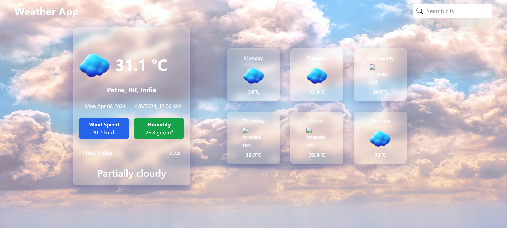
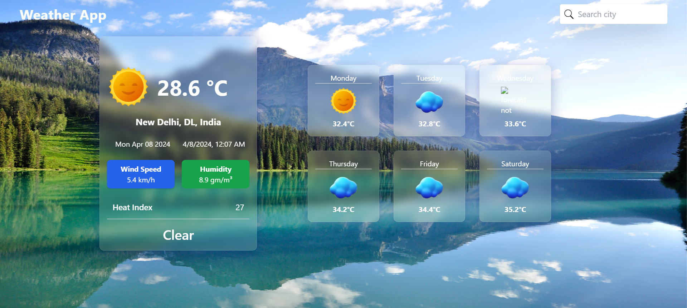
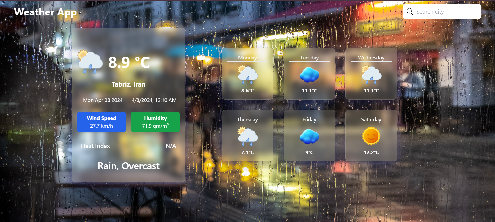

# Weather App 
This is a Weather App Web Application created with the help of Reactjs + Vite and Tailwind CSS. It enables user to search different states or country to view the weather forecast. 
Weather Forcast are updated dynamically using [Rapid API](https://rapidapi.com/).

## Preview Demo
[Live Demo](https://tangerine-caramel-48993a.netlify.app/)

## Preview Screenshorts




## Features

- Search various state/city/country using the search bar.
- User Friendly Interface.

## Use This Project on Your Computer/Laptop or Other Devices

1. Clone this repository :

   ```bash
   git clone <respository-url>

- Open VSCode in your Device.
- Open the folder weather app.
- Now, write in terminal 'npm run dev'.
- VSCode provide a localhost link.
- Open the link in web browser and use the weather app.

## API Used

Weather Forecast API :- It provides to you weather forecast.

Rapid API :- It provides the api to view the weather forecast of different countries/states/city.

Repository :- https://github.com/Sajidahmed8/weather-app-with-react-tailwindcss

Website :- https://www.rapidapi.com/
